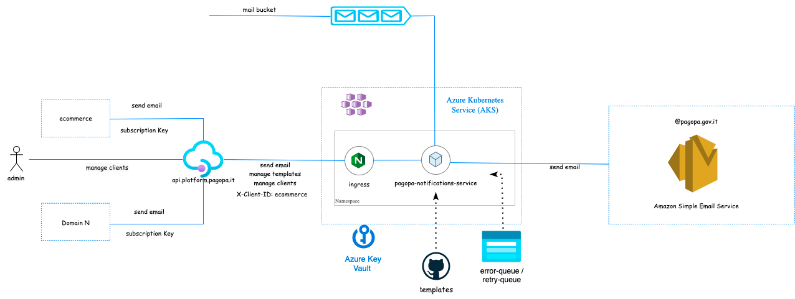

# pagoPA notifications service

This project implements the APIs to enable user receipts for _ecommerce platform_.

## Architecture overview




### Setup


Install the dependencies:

```
$ yarn install
```

Create a file `.env` in your cloned repo, with the contents similar to `.env.example`

### Attention must be paid to the mandatory variables for connection to PDV.

| Variable name                                  |  Description                                                                                                                                                             | type   | required |
|------------------------------------------------|--------------------------------------------------------------------------------------------------------------------------------------------------------------------------|--------|----------|
|PERSONAL_DATA_VAULT_API_KEY                     | API Key for Personal Data Vault (PDV is used to safely encrypt PIIs, in this case it will be used to encrypt the body with sensitive data to write on the queues)        | string |   yes    |    
|PERSONAL_DATA_VAULT_API_HOST                    | API base host for Personal Data Vault                                                                                                                                    | string |   yes    |    
|PERSONAL_DATA_VAULT_API_BASE_PATH               | API base path for Personal Data Vault                                                                                                                                    | string |   no     |
|STORAGE_TRANSIENT_CONNECTION_STRING               | Storage transient queues connection string                                                                                        | string |   yes     |
|STORAGE_DEADLETTER_CONNECTION_STRING               | Storage deadletter queues connection string                                                                                        | string |   yes     |

### Starting the API runtime

```
$ yarn start
```

The server should reload automatically when the code changes.

This microservice use https://github.com/pagopa/aks-microservice-chart-blueprint to release it in k8s.

## How to upgrade helm microservice chart release

Follow this steps if you need to upgrade the microservice-chart release.

### step 1) update dependencies microservice-chart version

```yaml
apiVersion: v2
name: microservice-ms
description: microservice-ms
type: application
version: 1.0.0
appVersion: 1.0.0
dependencies:
  - name: microservice-chart
    version: 1.21.0 
    repository: 'https://pagopa.github.io/aks-microservice-chart-blueprint'
```

### step2) update helm dependency to set Chart.lock

```sh
helm dependency update helm/
```
